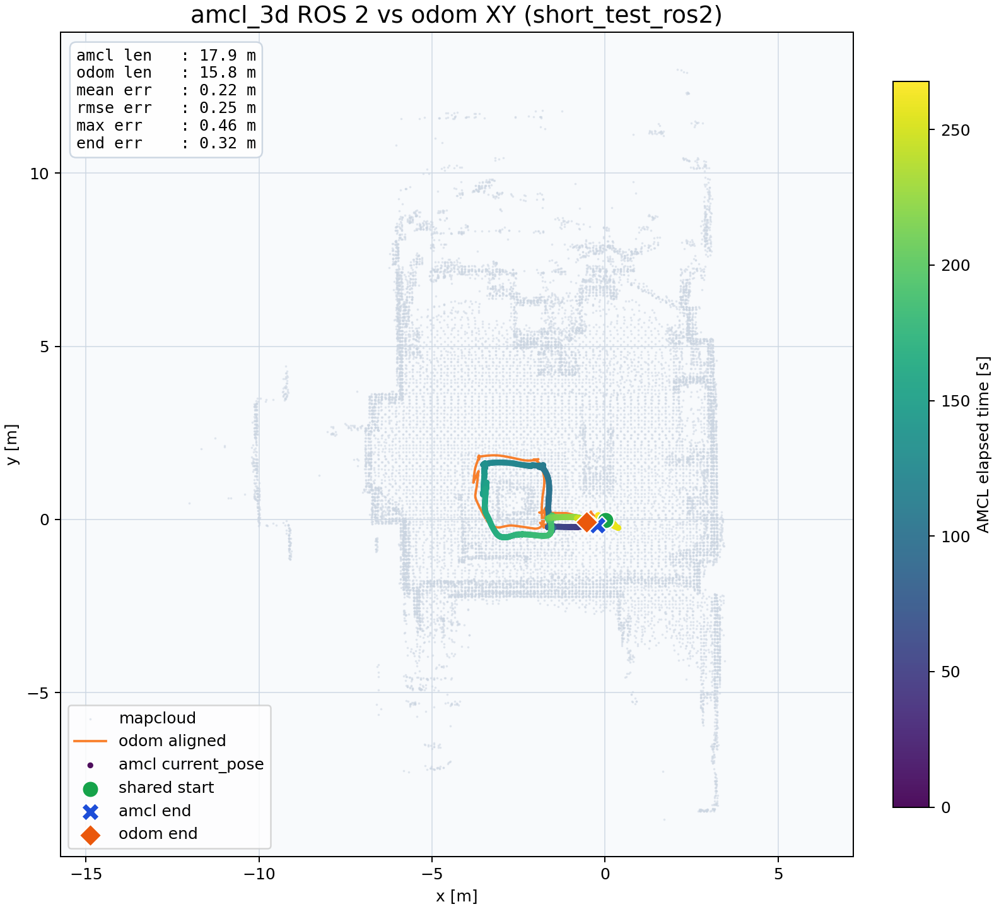

# amcl_3d

3D AMCL (Adaptive Monte Carlo Localization) for ROS 2 Jazzy.

The plot below compares `odom` and AMCL XY trajectories from a `short_test` rosbag2 replay.

- `/odom` is aligned to the `map` frame using the initial pose and yaw for comparison
- AMCL trajectory length: `17.9 m`
- Odom trajectory length: `15.8 m`
- Mean XY difference: `0.22 m`
- XY RMSE: `0.25 m`
- Max XY difference: `0.46 m`
- End-point XY difference: `0.32 m`
- Build / run instructions: [src/amcl_3d/README.md](src/amcl_3d/README.md)
- Trajectory plot script: [reports/generate_short_test_trajectory.py](reports/generate_short_test_trajectory.py)

## Branches

| Branch | Description |
|--------|-------------|
| `main` | ROS 2 Jazzy (active) |
| `ros2` | ROS 2 backup branch |
| `ros1` | ROS 1 version |
