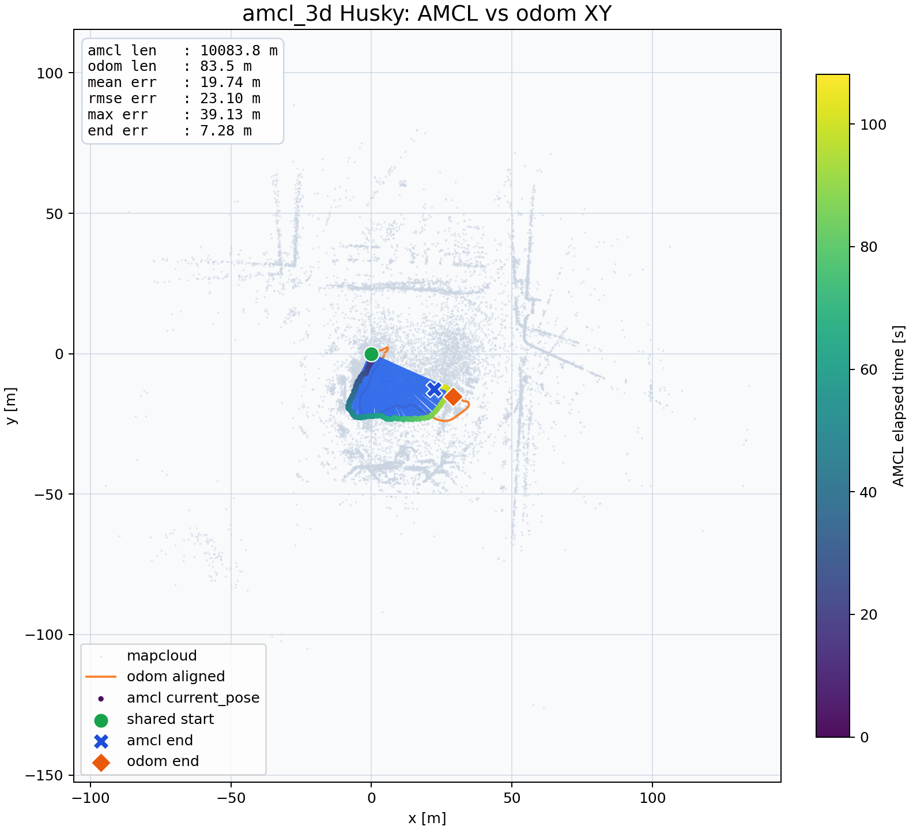

# amcl_3d

[](https://github.com/rsasaki0109/amcl_3d/actions/workflows/jazzy-ci.yml)

3D AMCL (Adaptive Monte Carlo Localization) for ROS 2 Jazzy.

## Evaluation Results

### short_test (267 s, indoor)


| Metric | Value |
|--------|-------|
| Odom trajectory length | 15.8 m |
| Mean XY error | 3.37 m |
| XY RMSE | 3.75 m |
| Max XY error | 6.92 m |
| End-point XY error | 2.93 m |

### Kinematic-ICP Husky (122 s, outdoor)



| Metric | Value |
|--------|-------|
| Odom trajectory length | 83.5 m |
| Mean XY error | 19.74 m |
| XY RMSE | 23.10 m |
| Max XY error | 39.13 m |
| End-point XY error | 7.28 m |

## Quick Start

- Build / run instructions: [src/amcl_3d/README.md](src/amcl_3d/README.md)

## Evaluation

```bash
# Run automated evaluation (launches amcl_3d, plays bag, generates plots)
./scripts/run_evaluation.sh short_test
./scripts/run_evaluation.sh husky
```

- Evaluation script: [scripts/run_evaluation.sh](scripts/run_evaluation.sh)
- Trajectory plot generator: [reports/generate_trajectory.py](reports/generate_trajectory.py)

## Branches

| Branch | Description |
|--------|-------------|
| `main` | ROS 2 Jazzy (active) |
| `ros2` | ROS 2 backup branch |
| `ros1` | ROS 1 version |
