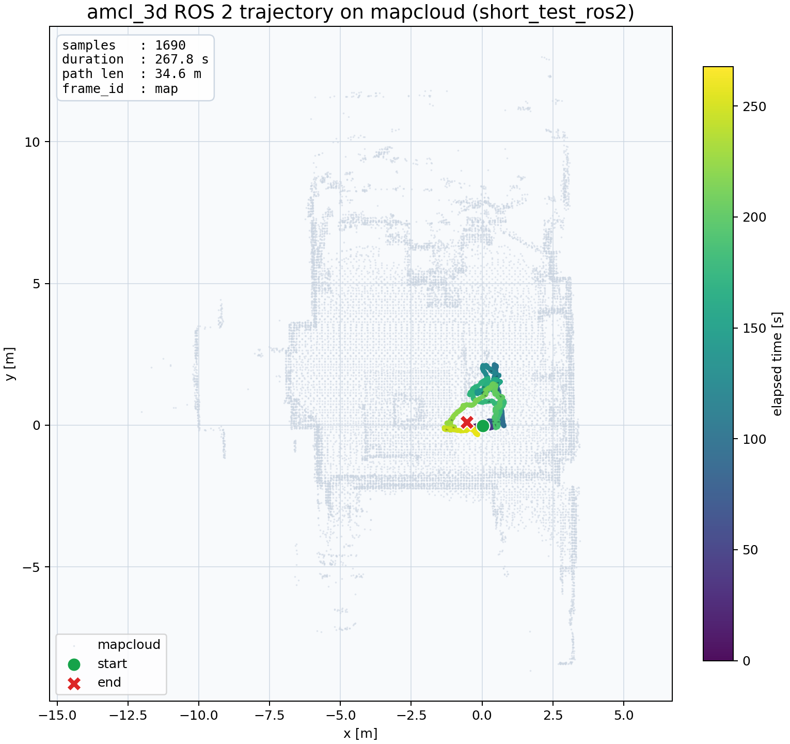

# amcl_3d_ros2

ROS1 `amcl_3d` を ROS 2 Jazzy 向けに移植したワークスペースです。

`short_test.bag` を rosbag2 に変換して流したデモ結果は下の mapcloud 重ね版で確認できます。

- パッケージの build / run 手順: [src/amcl_3d/README.md](src/amcl_3d/README.md)
- デモ結果レポート: [reports/short_test_demo.md](reports/short_test_demo.md)
- 元の ROS1 リポジトリ: https://github.com/rsasaki0109/amcl_3d
