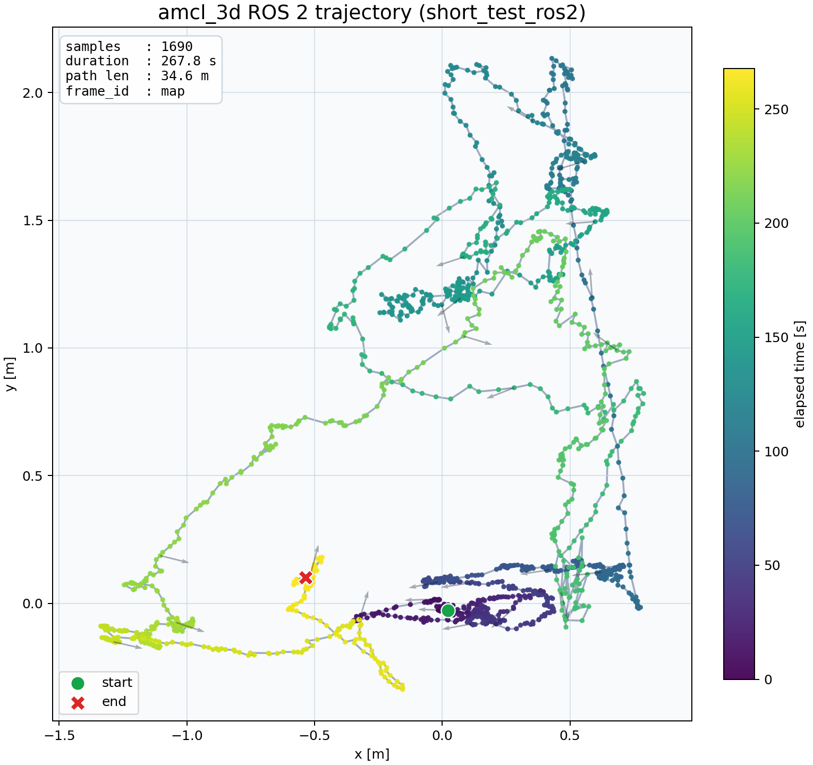

# short_test rosbag2 demo report

`amcl_3d_rosbag.launch.py` を使って、ROS1 版の `short_test.bag` を rosbag2 に変換した `short_test_ros2` を再生し、`/current_pose` の軌跡を確認した結果です。

## 実行コマンド

```bash
cd ~/workspace/amcl_3d_ros2_ws
source /opt/ros/jazzy/setup.bash
colcon build --symlink-install
source install/setup.bash

timeout 90s ros2 topic echo /current_pose geometry_msgs/msg/PoseStamped --csv \
  --qos-durability transient_local \
  --qos-reliability reliable \
  > /tmp/short_test_current_pose_full.csv &

timeout 90s ros2 launch amcl_3d amcl_3d_rosbag.launch.py \
  bag_path:=~/workspace/amcl_3d_ros2_ws/demo_data/short_test_ros2 \
  open_rviz:=false \
  bag_loop:=false \
  bag_rate:=4.0

python3 reports/generate_short_test_trajectory.py \
  /tmp/short_test_current_pose_full.csv \
  reports/assets/short_test_trajectory.png \
  --title "amcl_3d ROS 2 trajectory (short_test_ros2)"

python3 reports/generate_short_test_trajectory.py \
  /tmp/short_test_current_pose_full.csv \
  reports/assets/short_test_trajectory_on_map.png \
  --bag-path ~/workspace/amcl_3d_ros2_ws/demo_data/short_test_ros2 \
  --title "amcl_3d ROS 2 trajectory on mapcloud (short_test_ros2)"
```

## 結果

- サンプル数: `1690`
- bag 時間での追跡時間: `267.8 s`
- 推定軌跡長: `34.6 m`
- publish frame: `map`



### 地図点群に重ねた軌跡

`/mapcloud` の最初の `PointCloud2` を背景に重ねた版です。


## メモ

- 再生直後の数フレームは TF がまだ揃っておらず、`hokuyo3d_front` / `hokuyo3d_rear` に対する外挿警告が出ますが、その後 `received map` まで進み、`/current_pose` は継続して publish されます。
- `demo_data/` 配下の bag はサイズが大きいので git には含めていません。
- `reports/generate_short_test_trajectory.py` は `--bag-path` を渡すと `/mapcloud` を読んで背景に重ねます。
